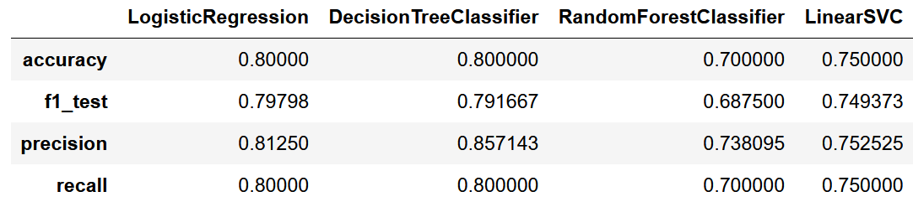

# Sparkify Churn Prediction with PySpark ML and AWS EMR

File description:
- **PySpark Script (local)**: Sparkify_small_dataset.ipynb
- **AWS EMR Deployment Script**: Sparkify_full_dataset.ipynb

**To access full fataset in S3**: "s3n://udacity-dsnd/sparkify/sparkify_event_data.json"

## Overview
**Sparkify** is a digital music service similar to [**Netease** **Cloud** **Music**]( https://music.163.com/ ) or [**QQ Music**](https://y.qq.com). Many of the users stream their favorite songs in Sparkify service everyday, either using free tier that places advertisements in between the songs, or using the premium subscription model where they stream music as free, but pay a monthly flat rate. User can upgrade, downgrade or cancel their service at anytime.  

This is a `Customer Churn Prediction Problem` , there are so many similar projects, such as [WSDM - KKBox's Churn Prediction Challenge](https://www.kaggle.com/c/kkbox-churn-prediction-challenge) competition from [Kaggle](https://www.kaggle.com).

Our job is to implement a machine learning model that can predict the churn rate. For this i will do the following steps:

- Clean data: remove unnecessary data, clean NANs, create churn collum, etc..
- EDA: explore the data to see the data and the correlation with the churn column.
- Feature engineering: extract the main features  and implement standarization on the data.
- Train and measure models:  All the previous steps where conducted in a smmaler dataset. With this dataset the best model was the linearregression. 

## Installation

- Python 3.6
- PySpark ML
- Jupyter

#### Data schema:

- artist: string (nullable = true)
- auth: string (nullable = true)
- firstName: string (nullable = true)
- gender: string (nullable = true)
- itemInSession: long (nullable = true)
- lastName: string (nullable = true)
- length: double (nullable = true)
- level: string (nullable = true)
- location: string (nullable = true)
- method: string (nullable = true)
- page: string (nullable = true)
- registration: long (nullable = true)
- sessionId: long (nullable = true)
- song: string (nullable = true)
- status: long (nullable = true)
- ts: long (nullable = true)
- userAgent: string (nullable = true)
- userId: string (nullable = true)

## Feature Selection
After exploring the dataset, 7 features have been chosen for further analysis:

- gender: female = 1, male = 0
- time_from_creation: days since registration at the last user login time
- paid_user: whether the user has ever used paid tier service
- Downgrade: whether the user has ever downgraded 
- total_songs_played - total number of songs played by the user
- interactions - max user actions
- session_time -days since registration and the session

## Results

I used four models to get the baseline: Logistic Regression, Linear SVC, Decision Tree Classifier and Random Forest Classifier.
This gave us the following result with the smaller dataset:

With the full dataset i got this results for the F1 Score with the default parameters:

LogisticRegression:  0.7530376437311861
DecisionTreeClassifier:  0.7281994453132363
RandomForestClassifier: 0.7133317926181466
LinearSVC:  0.7569933772112831

With the Logistic and the SVC close in scoring i choose to do a cross-validation with both. The results are (f1 score):

LogisticRegression :0.7435218879141079. Best Param (regParam):  0.01 .Best Param (MaxIter):  10. Best Param (elasticNetParam):  0.0
LinearSVC: 0.755621576663529. Best Param (regParam):  0.01 . Best Param (MaxIter):  100

So the LinearSVS is slightly better, but it took a longer time to run. So for the sake of economy we will take the Logistic Regression as the final model

## AWS EMR Deployment
The pipeline is deployed on AWS EMR with full data. 

## References

Dataset provided by [Udacity](https://cn.udacity.com/).
